# 1. Instagram Engagement Analytics Database

## 2. One-sentence value proposition

A recruiter-ready MySQL portfolio project that turns 218 synthetic Instagram interaction records into reproducible insights about content performance, attention, creators, hashtags, devices, sentiment, reactions, and audience behavior.

## 3. Project overview

This project models the core mechanics of a social-media engagement system using eight normalized relational tables. It captures who creates content, how users access the app, what they view, how long they watch, which hashtags are attached, and how they react or comment.

The repository is a polished portfolio edition of a BADM 352 academic database project. It includes a production-style MySQL schema, reusable seed data, ten analytical queries, validated query outputs, an ER diagram, data-quality tests, and recruiter-oriented documentation.

## 4. Business or research problem

Content teams need to understand more than raw post counts. They need to know:

- which formats generate attention;
- which content and creators retain viewers;
- whether hashtags are associated with stronger engagement;
- how device context affects behavior;
- where reactions and comments reveal different audience intent; and
- which users or sessions should be prioritized for deeper analysis.

This database converts those questions into a relational data model and an inspectable SQL workflow.

## 5. Why this project matters

Social platforms generate many-to-many relationships and high-volume event data. Even in a compact dataset, reliable analysis requires correct keys, defensible joins, consistent grains, normalized metrics, and protection against join multiplication. The project demonstrates how SQL can move from database design to decision-relevant analysis while keeping every result reproducible.

## 6. Key questions answered

1. Which content type produces the strongest overall engagement?
2. Which individual content items generate the most watch time?
3. Which hashtags are linked to higher view volume and watch time?
4. Which creators generate attention most efficiently?
5. How does engagement differ by operating system and device?
6. Which content receives the strongest comment sentiment?
7. How does reaction mix vary across feed, explore, and profile sources?
8. Which users like content without commenting on the same item?
9. Which users qualify for a high-value publishing audience?
10. Which sessions fall into the highest engagement quartile?

## 7. Dataset description

The project uses a fully synthetic dataset designed for relational analysis. It contains no real Instagram users or platform data.

| Dataset component | Rows |
|---|---:|
| Users | 10 |
| Content items | 15 |
| Sessions | 12 |
| Hashtags | 12 |
| Content-hashtag assignments | 34 |
| Likes | 55 |
| Comments | 30 |
| View events | 50 |
| **Total** | **218** |

The observation window for content events is April 10-11, 2026. Content upload dates range from April 1-10, 2026. Seed data is stored in [`sql/01_seed_data.sql`](sql/01_seed_data.sql).

## 8. Database schema

The schema contains eight normalized tables:

- `users`, `content`, and `hashtags` store core entities;
- `sessions` stores app visits;
- `likes`, `comments`, and `view_logs` store interaction events; and
- `content_hashtags` resolves the many-to-many relationship between content and hashtags.

Primary keys, unique constraints, foreign keys, domain checks, and targeted indexes enforce integrity and support analytical joins. The complete table-by-table explanation is in [`docs/database_schema.md`](docs/database_schema.md), and the executable DDL is in [`sql/00_schema.sql`](sql/00_schema.sql).

## 9. ER diagram

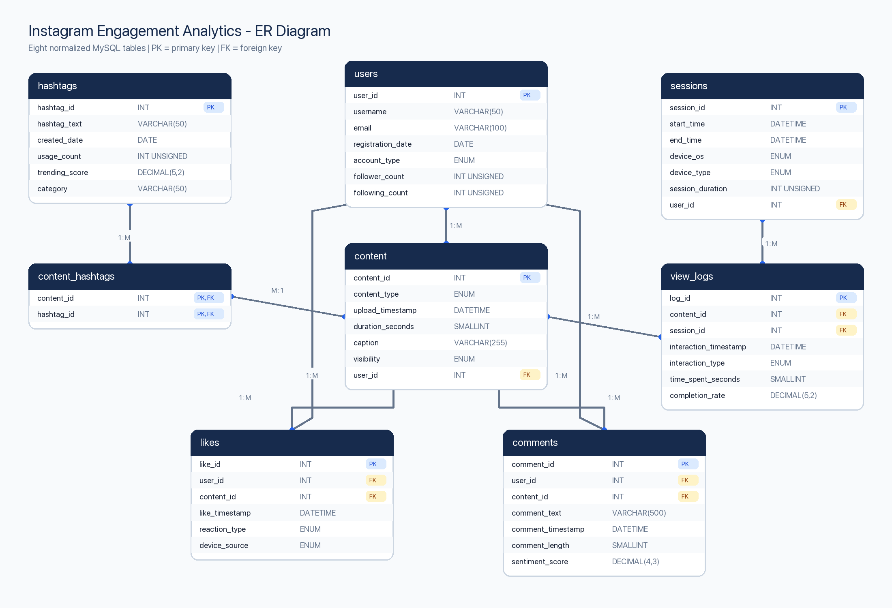

The diagram can be regenerated with:

```bash
python scripts/generate_er_diagram.py
```

## 10. Technical stack

- **Database:** MySQL 8.0, InnoDB
- **SQL:** DDL, DML, joins, CTEs, window functions, conditional aggregation, anti-joins, `UNION ALL`, `GROUP_CONCAT`, and data-quality checks
- **Environment:** Docker Compose or local MySQL
- **Reproducibility:** Python 3 and Pillow for CSV/PNG result exports
- **Documentation:** Markdown and generated ER/result images

## 11. Repository structure

```text
instagram-engagement-sql-analytics/
├── README.md
├── LICENSE
├── docker-compose.yml
├── requirements.txt
├── docs/
│   ├── database_schema.md
│   └── er_diagram.png
├── results/
│   ├── csv/
│   │   └── 10 reproducible query outputs
│   └── screenshots/
│       └── 10 MySQL result screenshots
├── scripts/
│   ├── generate_er_diagram.py
│   └── generate_results.py
└── sql/
    ├── 00_schema.sql
    ├── 01_seed_data.sql
    ├── 02_data_quality_checks.sql
    ├── 99_run_all_queries.sql
    └── queries/
        └── 10 analytical SQL files
```

## 12. Setup instructions

### Option A: Docker Compose

Requirements: Docker Desktop and a MySQL client.

```bash
git clone https://github.com/yfandd520-stack/instagram-engagement-sql-analytics.git
cd instagram-engagement-sql-analytics
cp .env.example .env
docker compose up -d
```

The container exposes MySQL on port `3307`. After it becomes healthy, initialize the project:

```bash
mysql -h 127.0.0.1 -P 3307 -u root -p < sql/00_schema.sql
mysql -h 127.0.0.1 -P 3307 -u root -p < sql/01_seed_data.sql
```

### Option B: Existing MySQL 8 installation

```bash
mysql -u root -p < sql/00_schema.sql
mysql -u root -p < sql/01_seed_data.sql
```

## 13. How to run the project

Run all analytical queries from the repository root:

```bash
mysql -h 127.0.0.1 -P 3307 -u root -p < sql/99_run_all_queries.sql
```

Run the data-quality suite:

```bash
mysql -h 127.0.0.1 -P 3307 -u root -p < sql/02_data_quality_checks.sql
```

Regenerate all CSV outputs and result screenshots:

```bash
python -m pip install -r requirements.txt
MYSQL_PASSWORD=portfolio_dev python scripts/generate_results.py
```

## 14. Example SQL queries

| # | Analysis | SQL techniques | Query | Result |
|---:|---|---|---|---|
| 1 | Content-type performance | CTEs, pre-aggregation, `LEFT JOIN` | [SQL](sql/queries/01_content_type_performance.sql) | [CSV](results/csv/01_content_type_performance.csv) |
| 2 | Top content by attention | CTE, multi-table join, `DENSE_RANK` | [SQL](sql/queries/02_top_content_by_attention.sql) | [CSV](results/csv/02_top_content_by_attention.csv) |
| 3 | Hashtag engagement | M:N bridge, aggregation, ranking | [SQL](sql/queries/03_hashtag_engagement.sql) | [CSV](results/csv/03_hashtag_engagement.csv) |
| 4 | Creator performance | Join-explosion prevention, normalized KPI | [SQL](sql/queries/04_creator_performance.sql) | [CSV](results/csv/04_creator_performance.csv) |
| 5 | Device engagement | Distinct counts, session normalization | [SQL](sql/queries/05_device_engagement.sql) | [CSV](results/csv/05_device_engagement.csv) |
| 6 | Comment sentiment | `CASE`, `HAVING`, window ranking | [SQL](sql/queries/06_comment_sentiment.sql) | [CSV](results/csv/06_comment_sentiment.csv) |
| 7 | Reaction mix by source | Partitioned window denominator | [SQL](sql/queries/07_reaction_mix_by_source.sql) | [CSV](results/csv/07_reaction_mix_by_source.csv) |
| 8 | Silent engagers | Correlated `NOT EXISTS` anti-join | [SQL](sql/queries/08_silent_engagers.sql) | [CSV](results/csv/08_silent_engagers.csv) |
| 9 | Audience segmentation | `UNION ALL`, deduplication, `GROUP_CONCAT` | [SQL](sql/queries/09_audience_segmentation.sql) | [CSV](results/csv/09_audience_segmentation.csv) |
| 10 | Session quartiles | Session-level CTE, `NTILE` | [SQL](sql/queries/10_session_engagement_quartiles.sql) | [CSV](results/csv/10_session_engagement_quartiles.csv) |

Example: the creator query first aggregates each event table to content grain before joining. This prevents likes, comments, and views from multiplying one another.

```sql
WITH content_events AS (
  SELECT
    c.content_id,
    c.user_id,
    COALESCE(v.views, 0) AS views,
    COALESCE(v.watch_seconds, 0) AS watch_seconds,
    COALESCE(l.likes, 0) AS likes,
    COALESCE(cm.comments, 0) AS comments
  FROM content AS c
  LEFT JOIN (...) AS v ON c.content_id = v.content_id
  LEFT JOIN (...) AS l ON c.content_id = l.content_id
  LEFT JOIN (...) AS cm ON c.content_id = cm.content_id
)
SELECT ...
```

<details>
<summary><strong>View all 10 MySQL result screenshots</strong></summary>

### Query 1 - Content-type performance

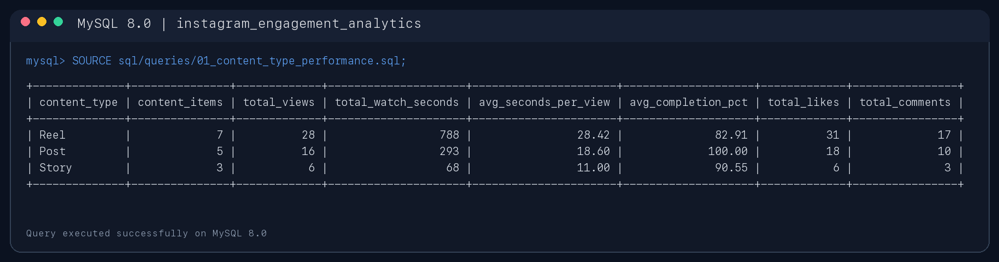

### Query 2 - Top content by attention

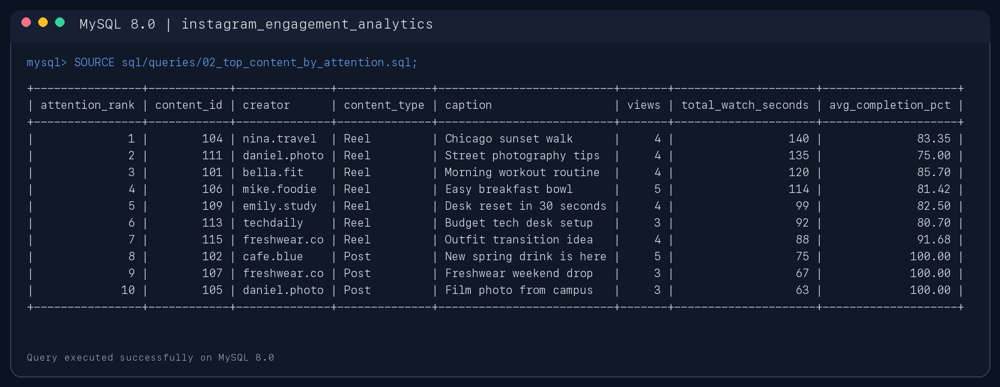

### Query 3 - Hashtag engagement

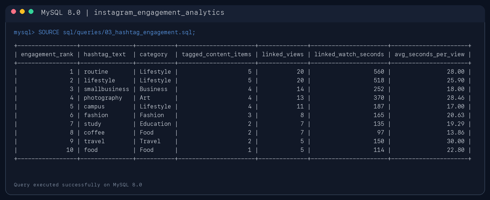

### Query 4 - Creator performance

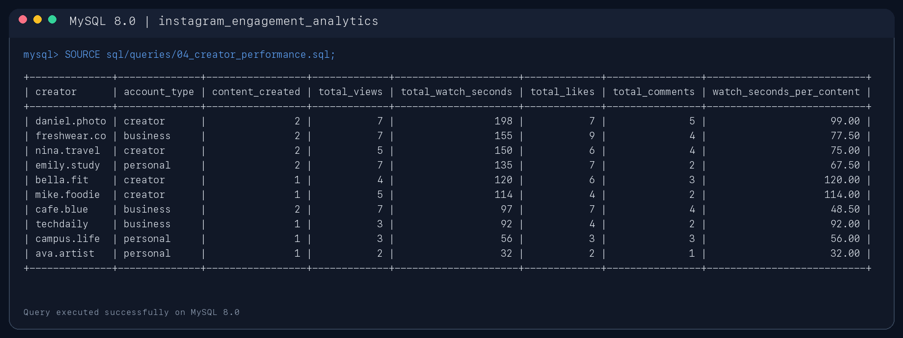

### Query 5 - Device engagement

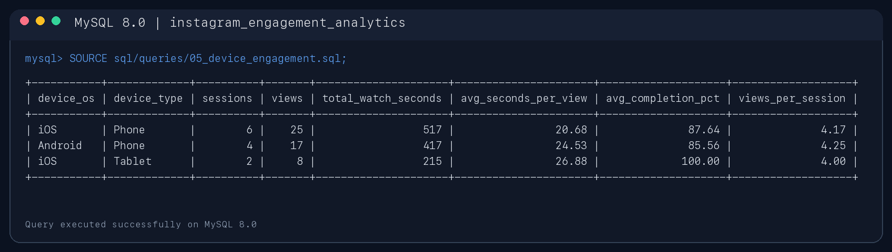

### Query 6 - Comment sentiment

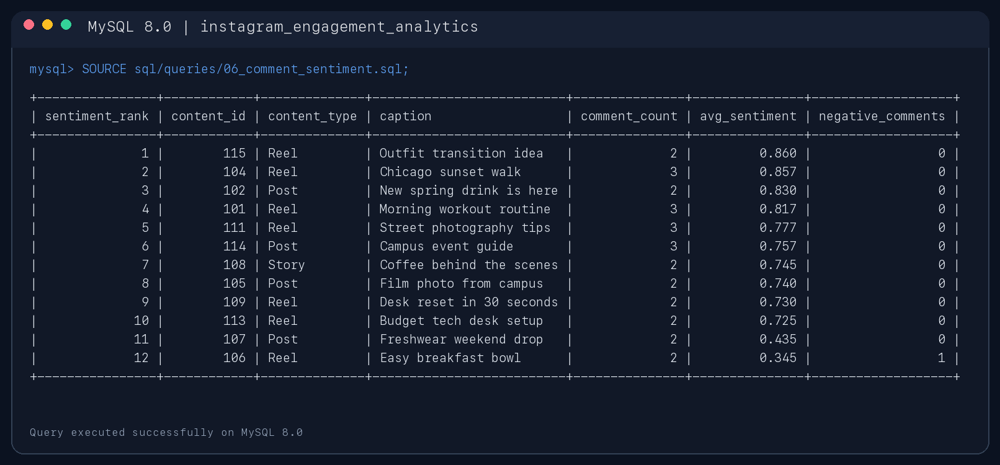

### Query 7 - Reaction mix by source

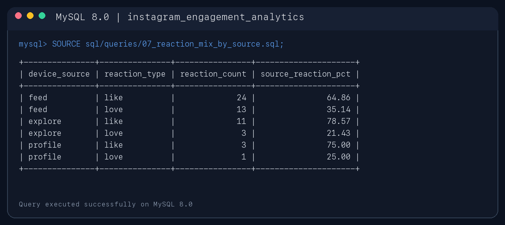

### Query 8 - Silent engagers

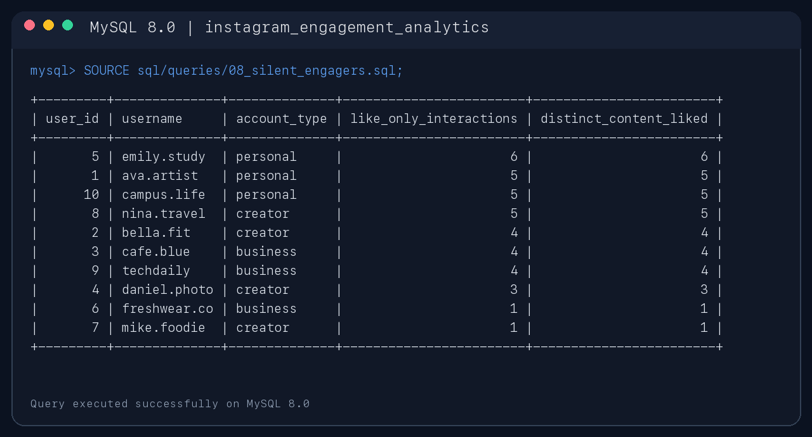

### Query 9 - Audience segmentation

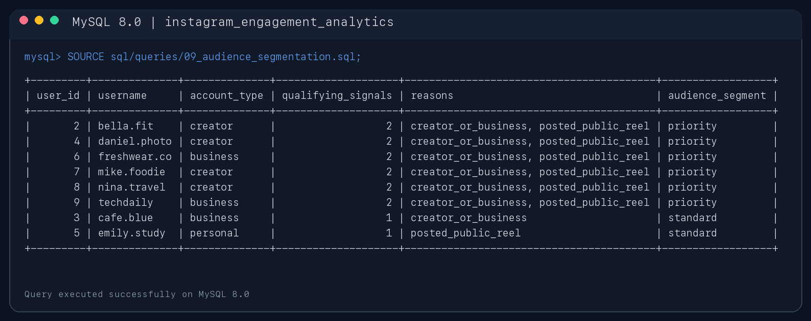

### Query 10 - Session engagement quartiles

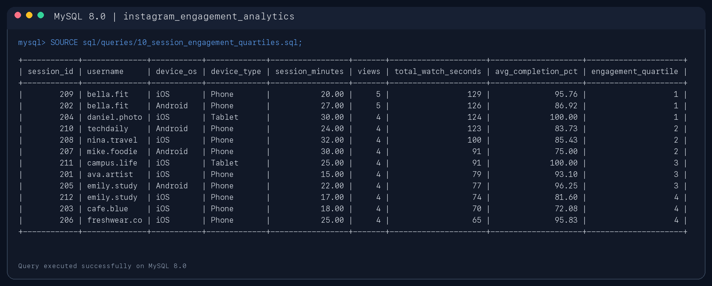

</details>

## 15. Key findings

- **Reels create disproportionate attention.** Reels are 46.7% of content but generate 68.6% of total watch time, 56.0% of views, 56.4% of likes, and 56.7% of comments.
- **The top attention set is entirely short-form video.** The seven highest-watch-time content items are all Reels. “Chicago sunset walk” ranks first with 140 watch seconds.
- **Hashtag scale and depth are not the same.** `#routine` and `#lifestyle` each lead with 20 linked views; `#travel` has the highest average time among the top ten hashtags at 30.0 seconds, but on only five linked views.
- **Creator scale differs from per-item efficiency.** `daniel.photo` leads total watch time at 198 seconds, while `bella.fit` leads watch time per content item at 120 seconds on a one-item base.
- **Device results require sample-size context.** iOS tablets show the highest average time per view at 26.88 seconds and 100% completion, but represent only two sessions and eight views.
- **Silent engagement is measurable.** `emily.study` records six like-only interactions, the highest count in the sample.
- **Six users meet both audience-priority signals.** They are creator/business accounts that also posted a public Reel.

These findings are descriptive signals from a small synthetic sample; they are not causal platform recommendations.

## 16. Data-quality checks

The validation suite produced the following results:

| Check | Result |
|---|---|
| Expected row counts across all eight tables | 8 of 8 passed |
| Foreign-key orphan checks | 10 relationships, 0 orphan rows |
| Session duration versus timestamp difference | 0 mismatches |
| Completion rate within 0-100 | 0 violations |
| Sentiment score within -1 to 1 | 0 violations |
| Stored comment length versus text length | 0 mismatches |
| Duplicate user-content likes | 0 duplicates |

The full tests are in [`sql/02_data_quality_checks.sql`](sql/02_data_quality_checks.sql).

## 17. Limitations

- The dataset is synthetic and intentionally small; results illustrate SQL reasoning, not Instagram-wide behavior.
- View activity covers two days, so trend, retention, and seasonality analysis are out of scope.
- Completion rates are not perfectly comparable across formats: Posts are stored with zero media duration and 100% completion.
- Hashtag metrics attribute a view to every hashtag attached to the viewed content; totals across hashtags therefore overlap.
- Comment sentiment scores are supplied fields rather than outputs from a documented production model.
- The schema does not include follows, shares, saves, impressions, experiments, or recommendation exposure.
- All findings are descriptive. No query establishes causality.

## 18. Future improvements

- Expand the event window and volume to support daily trends, cohorts, and retention.
- Add impressions, saves, shares, follows, and recommendation-source events.
- Separate media completion from feed dwell time for more comparable format metrics.
- Add user-level privacy controls and anonymized analytical identifiers.
- Benchmark indexes with `EXPLAIN ANALYZE` on a larger dataset.
- Build a BI dashboard on top of reusable analytical views.
- Add automated MySQL validation in CI and parameterized date filters.

## 19. Skills demonstrated

- Relational data modeling and normalization
- Primary keys, foreign keys, composite keys, constraints, and indexes
- Reproducible schema and seed-data design
- Multi-table joins and many-to-many bridge tables
- Common table expressions and window functions
- Conditional aggregation and normalized metrics
- Anti-joins with correlated `NOT EXISTS`
- Prevention of join multiplication
- Data-quality validation and integrity testing
- Business-question framing and evidence-based communication
- Technical documentation and reproducible result generation

